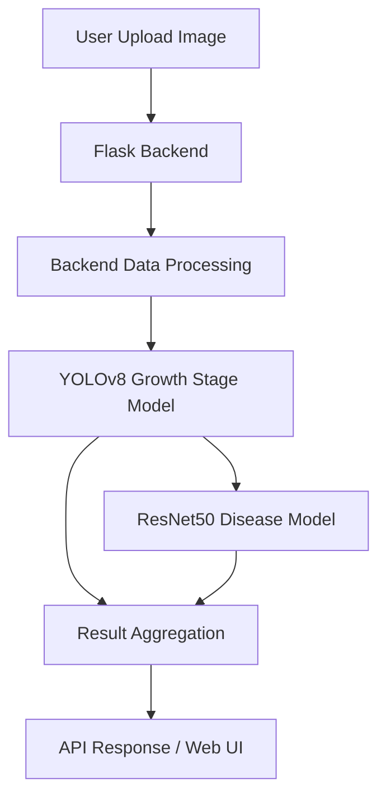

# Agri-Vision Architecture

## Overview

Agri-Vision is an AI-powered crop analysis platform designed to analyze cotton crop images using deep learning and computer vision techniques. The system helps identify crop growth stages and detect diseases through a web interface and REST API.

The project combines Flask, PyTorch, YOLOv8, ResNet50, OpenCV, and modern deployment tools to create a scalable agriculture-focused AI solution.

---

# System Architecture

The platform follows a layered architecture consisting of:

1. Frontend Layer  
2. Backend Layer  
3. AI Inference Layer  
4. Data Processing Layer  
5. Deployment Layer  

### Layer Responsibilities

- Frontend Layer: user interface, image upload, display of predictions.
- Backend Layer: Flask routing, file handling, API orchestration, pre-inference data processing, and result formatting.
- AI Inference Layer: model execution for growth stage and disease classification.
- Data Processing Layer: implemented as part of the backend execution flow before model inference, handling image validation, resizing, normalization, and tensor preparation.
- Deployment Layer: containerization, runtime environment, and reverse proxy management.

---

## System Architecture Diagram



The Data Processing Layer is part of the backend pipeline and prepares images for model inference.

---

# High-Level Workflow

User uploads crop image  
↓  
Flask backend receives request  
↓  
Backend data processing validates and pre-processes the image  
↓  
YOLOv8 and ResNet50 perform inference  
↓  
Prediction results are aggregated  
↓  
Recommendations are prepared and returned by web interface or API  

---

# Core Components

## 1. Frontend Layer

The frontend is built using HTML, CSS, and JavaScript with Flask templates.

### Responsibilities

- Image upload interface
- Result visualization
- API interaction
- Responsive user experience
- Error handling and feedback

### Main Directories

- templates/
- static/

---

## 2. Backend Layer

The backend is powered by Flask and handles routing, API processing, file handling, and AI orchestration.

### Responsibilities

- Route handling
- File upload management
- API response generation
- AI workflow coordination
- Error handling
- Security validations

### Main File

- app.py

### Backend Features

- REST API support
- Secure file uploads
- JSON response generation
- Confidence score calculation
- Recommendation engine
- Graceful fallback handling

---

## 3. AI Inference Layer

The AI system uses two primary deep learning models.

### Growth Stage Detection Model

**Model Used:** YOLOv8

**Purpose:** Detect cotton growth stages

### Detected Stages

- Cotton Blossom
- Cotton Bud
- Early Boll
- Matured Cotton Boll
- Split Cotton Boll

### Disease Classification Model

**Model Used:** ResNet50

**Purpose:** Detect cotton crop diseases

### Detected Diseases

- Aphids
- Army Worm
- Bacterial Blight
- Cotton Boll Rot
- Powdery mildew
- Target spot

### Model Selection Reasoning

- YOLOv8 is used for growth stage detection due to its real-time object detection capability and strong performance on visual localization tasks.
- ResNet50 is used for disease classification because of its reliability in image classification tasks and strong transfer learning performance.

---

# AI Workflow

The uploaded image is validated and preprocessed, then passed through YOLOv8 and ResNet50 models as part of the inference pipeline execution. Predictions are aggregated into a single response with confidence scores and recommendations.

## Pipeline Steps

- Image validation and preprocessing
- Inference pipeline execution for growth stage and disease detection
- Result aggregation and recommendation generation

---

# Image Processing Pipeline

The image preprocessing workflow ensures optimized inference quality and model compatibility.

## Processing Steps

- File validation
- Image resizing
- Color normalization
- Tensor preparation
- Model inference
- Prediction post-processing

## Technologies Used

- OpenCV
- NumPy
- PyTorch Transforms

---

# API Architecture

Agri-Vision exposes a REST endpoint for image-based crop analysis.

## Main Endpoint

- `POST /api/analyze`

## Request / Response

- Input: image file (`multipart/form-data`)
- Output: JSON payload with growth stage, disease label, confidence scores, and recommendations

### Example Request

- Endpoint: POST /api/analyze
- Input: image file (multipart/form-data)

### Example Response

```json
{
  "growth_stage": "Cotton Bud",
  "disease": "Aphids",
  "confidence": {
    "growth_stage": 0.92,
    "disease": 0.87
  },
  "recommendations": [
    "Apply neem-based spray",
    "Monitor leaf underside regularly"
  ]
}
```

---

# Project Structure

## Important Directories

### `.github/`
Contains GitHub workflows and automation configurations.

### `models/`
Stores trained AI models.

### `results/`
Contains training results and visualizations.

### `scripts/`
Includes training and utility scripts.

### `static/`
Stores frontend assets such as CSS and uploaded files.

### `templates/`
Contains Flask HTML templates.

### `tests/`
Includes unit and integration tests.

---

# Testing Architecture

The project uses pytest-based testing with unit and integration coverage focused on Flask routes, upload handling, and mocked AI inference.

## Testing Features

- Route and utility unit tests
- Integration tests for file upload and API response formats
- Mocked inference for model-dependent workflows
- Coverage reporting and CI validation

## Testing Workflow

Code changes  
↓  
Pytest execution  
↓  
Coverage validation  
↓  
GitHub Actions verification  

---

# CI/CD Workflow

GitHub Actions automates:

- Dependency installation
- Unit and integration tests (pytest)
- Code coverage validation
- Pull request verification before merge

---

# Deployment Architecture

The project supports containerized deployment using Docker and Nginx.

## Deployment Components

### Flask Application
Handles backend logic and AI inference.

### Docker
Provides isolated and reproducible environments.

### Docker Compose
Manages multi-container services.

### Nginx
Acts as a reverse proxy and handles routing.

---

# Security Considerations

## Current Security Features

- Environment variable usage
- File upload validation
- Secure request handling
- Error handling protections
- Input validation for uploaded images to prevent invalid or malicious file uploads

## Recommended Future Improvements

- Rate limiting
- JWT authentication
- HTTPS enforcement
- Malware upload scanning
- API key management

---

# Scalability Considerations

The architecture is designed for container-based scaling and can grow by adding dedicated inference capacity and async processing.

- GPU-accelerated inference nodes or dedicated model-serving instances
- Asynchronous request handling with task queues for heavier workloads
- Cloud deployment with autoscaling and model version management

---

# Future Architecture Enhancements

## Planned Improvements

- Multi-crop support
- Real-time video inference
- Mobile application integration
- Weather-based prediction systems
- Edge AI deployment
- Cloud-based model serving
- Advanced analytics dashboards

---

# Technology Stack

## Backend

- Flask
- Python

## AI/ML

- PyTorch
- YOLOv8
- ResNet50
- OpenCV

## Frontend

- HTML5
- CSS3
- JavaScript

## Deployment

- Docker
- Docker Compose
- Nginx

## Testing

- Pytest
- Pytest-Cov

---

# Conclusion

Agri-Vision follows a modular AI-driven architecture designed for scalable crop analysis, disease detection, and intelligent agricultural recommendations. The architecture enables future expansion into multi-crop systems, cloud deployment, real-time AI analytics, and advanced agricultural intelligence solutions.