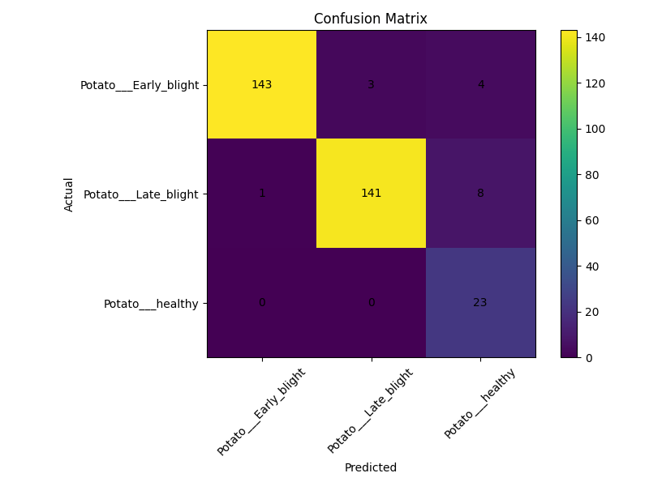
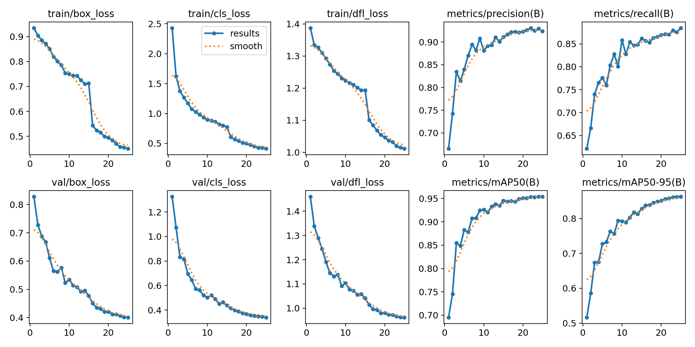
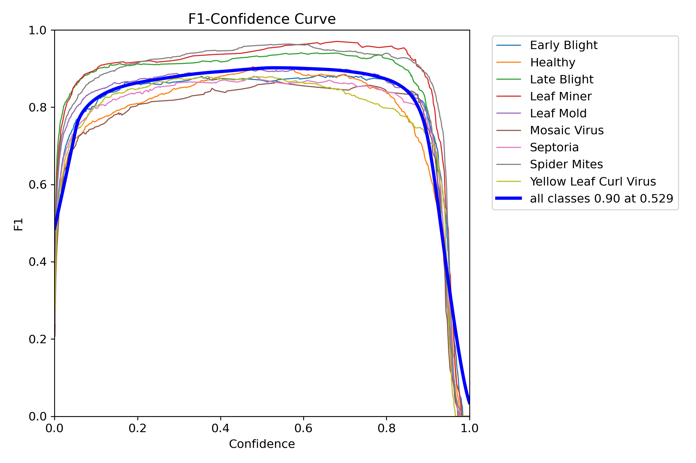
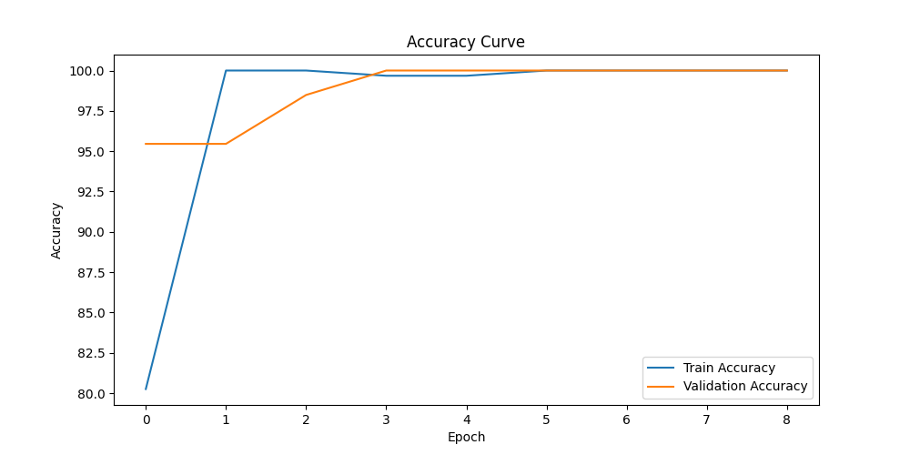
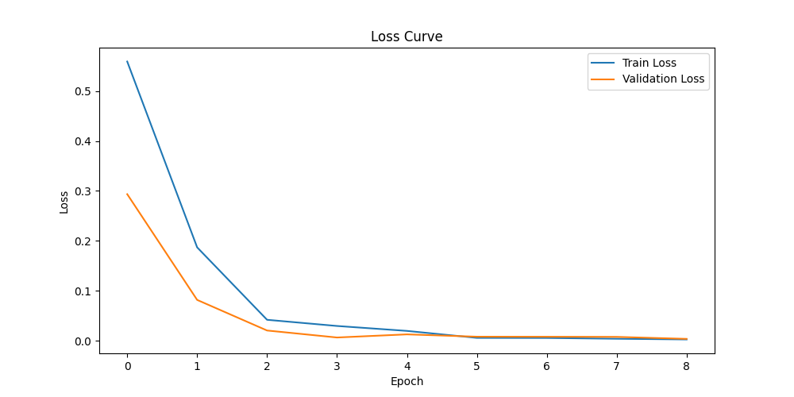
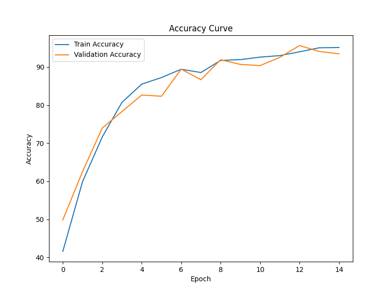
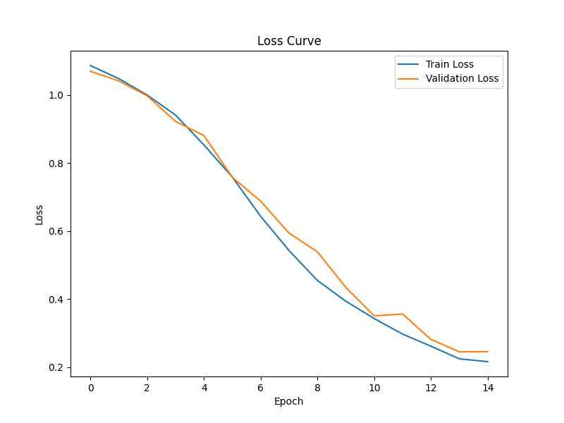
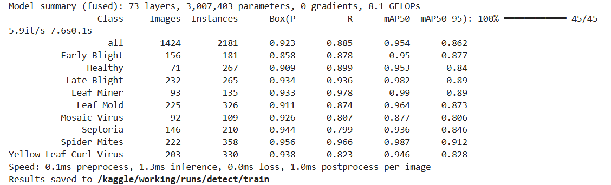
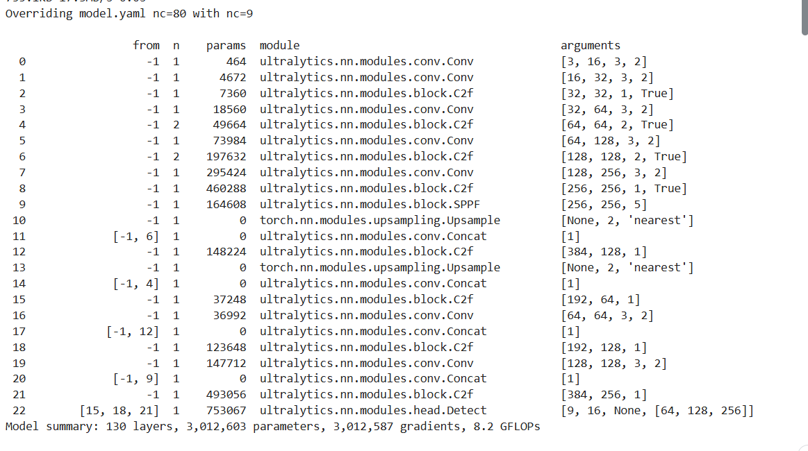

# Model Performance & Benchmarking

This page centralizes the model metrics and reproducibility notes that are currently spread across the README, training notebooks, and exported result artifacts.

## Benchmark Summary

| Crop | Task | Model | Primary metrics | Evidence artifacts |
| --- | --- | --- | --- | --- |
| Cotton | Growth stage detection | YOLOv8 | mAP50 60.06%, mAP95 34.8%, recall 53.8%, precision 62.7%, inference 3.3 ms | `results/cotton_crop_growth_stage_prediction/results.csv`, `results/cotton_crop_growth_stage_prediction/results.png`, confusion matrices |
| Cotton | Disease classification | ResNet50 | accuracy 99.83%, precision 99.83%, recall 99.83%, F1 99.83%, ROC AUC 99.98% | `results/cotton_crop_disease_classification/test_metrics.txt`, accuracy/loss curves, confusion matrix |
| Tomato | Disease detection | YOLOv8 | mAP50 95.4%, mAP95 86.2%, recall 88.5%, precision 92.3%, inference 1.3 ms | `results/tomato_crop_disease_classification/results.csv`, `results/tomato_crop_disease_classification/results.png`, PR/F1 curves |
| Tomato | Growth stage classification | ResNet50 | accuracy 100%, precision 100%, recall 100%, F1 100% | `results/tomato_crop_growth_stage_classification/classification_report.txt`, accuracy/loss curves, confusion matrix |
| Potato | Disease classification | CNN notebook pipeline | see classification report artifact | `results/potato_crop_disease_classification/classification_report.txt`, accuracy/loss curves, confusion matrix |

## Confusion Matrix Artifacts

Use the exported matrices to inspect class-level error patterns instead of relying on aggregate accuracy alone.

### Cotton Disease Classification

### Cotton Growth Stage Detection

### Tomato Growth Stage Classification

### Potato Disease Classification

## Training Curves

Training curves help identify overfitting, underfitting, and unstable validation behavior.

| Task | Accuracy / metrics | Loss / training result |
| --- | --- | --- |
| Cotton disease classification |  |  |
| Cotton growth stage detection |  |  |
| Tomato disease detection |  |  |
| Tomato growth stage classification |  |  |
| Potato disease classification |  |  |

## Sample Prediction Artifacts

The repository currently includes exported tomato disease detection samples. Keep sample outputs in this section tied to checked-in artifacts so reviewers can trace each screenshot back to the run that produced it.

| Task | Sample outputs |
| --- | --- |
| Tomato disease detection |   |

## Reproducing Results

The checked-in notebooks under `scripts/` are the source of truth for reproducing the exported artifacts:

| Task | Notebook |
| --- | --- |
| Cotton disease classification | `scripts/cotton_crop_disease_prediction.ipynb` |
| Cotton growth stage detection | `scripts/cotton_crop_growth_stage_prediction.ipynb` |
| Tomato disease detection | `scripts/tomato-crop-disease-classification.ipynb` |
| Tomato growth stage classification | `scripts/tomato-growth-stages-classification.ipynb` |
| Potato disease classification | `scripts/potato_crop_disease_classification.ipynb` |

Recommended reproducibility checklist:

1. Download the dataset linked in the README for the target crop/task.
2. Keep the same train/validation/test split used by the notebook.
3. Run the corresponding notebook from `scripts/`.
4. Export the generated metrics, confusion matrix, and curves into the matching `results/<task>/` directory.
5. Update the benchmark summary only when the artifact files and metric values come from the same run.

## Notes for Future Model Updates

- Do not update headline metrics without committing or linking the matching evaluation artifact.
- Prefer per-class reports and confusion matrices over accuracy alone, especially for imbalanced disease classes.
- Include inference-time measurements when changing model size, image resolution, or preprocessing.
